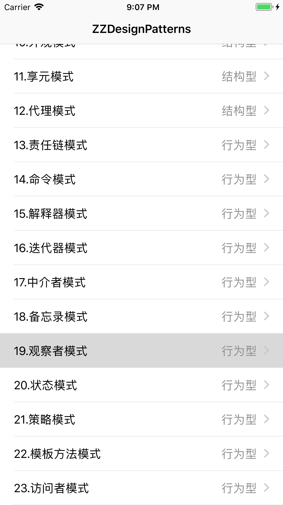

## 观察者模式

- **观察者模式：定义了一种一对多的依赖关系，让多个观察者对象同时监听某一个主题对象。这个主题对象在状态发生变化时，会通过所有观察者对象，使它们能够自动更新自己。**

先简单介绍苹果封装的消息通知，再献上根据观察者模式原理实现的源码。





## 消息通知

对于观察者模式，苹果封装了消息通知（NSNotification）和通知中心（NSNotificationCenter）供开发者调用。使用也比较简便，例如：

```
// defaultCenter
[[NSNotificationCenter defaultCenter] addObserver:observer selector:@selector(nsSelector:) name:ZZNotificationWithDefaultCenter object:nil];
[[NSNotificationCenter defaultCenter] postNotificationName:ZZNotificationWithDefaultCenter object:@"默认实例 >>>> defaultCenter"];
```
其中`@property (class, readonly, strong) NSNotificationCenter *defaultCenter;`只是苹果提供的一个单例，你也可以自己创建一个，例如：

```
// newCenter
NSNotificationCenter *newCenter = [NSNotificationCenter new];
[newCenter addObserver:observer selector:@selector(nsSelector:) name:ZZNotificationWithNew1 object:nil];
[newCenter postNotificationName:ZZNotificationWithNew1 object:@"newCenter1"];

```
需要注意的是，addObserver和postNotificationName的必须是同一个NSNotificationCenter实例。

如果不想调用selector，苹果也提供了执行block的方法：

```
- (id <NSObject>)addObserverForName:(nullable NSNotificationName)name object:(nullable id)obj queue:(nullable NSOperationQueue *)queue usingBlock:(void (^)(NSNotification *note))block API_AVAILABLE(macos(10.6), ios(4.0), watchos(2.0), tvos(9.0));
```

## 原理实现

参照着苹果提供的接口文档和使用，以及加上对观察者模式的理解，试着去实现ZZNotification、ZZNotification (ZZNotificationCreation)、ZZNotificationCenter三个类，用于存储前缀NS改成ZZ，如下：

ZZNotification.h

```
typedef NSString *ZZNotificationName;

@interface ZZNotification : NSObject<NSCopying>

@property (readonly, copy) ZZNotificationName name;
@property (nullable, readonly, retain) id object;
@property (nullable, readonly, copy) NSDictionary *userInfo;

- (instancetype)initWithName:(ZZNotificationName)name object:(nullable id)object userInfo:(nullable NSDictionary *)userInfo;

@end
```
ZZNotification.m

```
@implementation ZZNotification

- (instancetype)initWithName:(ZZNotificationName)name object:(id)object userInfo:(NSDictionary *)userInfo
{
    if (self = [super init]) {
        _name = name;
        _object = object;
        _userInfo = userInfo;
    }
    return self;
}

- (nonnull id)copyWithZone:(nullable NSZone *)zone
{
    return self;
}

@end
```

ZZNotification (ZZNotificationCreation).h

```
@interface ZZNotification (ZZNotificationCreation)

+ (instancetype)notificationWithName:(ZZNotificationName)aName object:(nullable id)anObject;
+ (instancetype)notificationWithName:(ZZNotificationName)aName object:(nullable id)anObject userInfo:(nullable NSDictionary *)aUserInfo;

+ (instancetype)new __attribute__((unavailable("use -initWithName:object:userInfo instead")));
- (instancetype)init __attribute__((unavailable("use -initWithName:object:userInfo instead")));

@end
```

ZZNotification (ZZNotificationCreation).m

```
@implementation ZZNotification (ZZNotificationCreation)

+ (instancetype)notificationWithName:(ZZNotificationName)aName object:(id)anObject
{
    return [self notificationWithName:aName object:anObject userInfo:nil];
}

+ (instancetype)notificationWithName:(ZZNotificationName)aName object:(id)anObject userInfo:(NSDictionary *)aUserInfo
{
    ZZNotification *notification = [[[self class] alloc] initWithName:aName object:anObject userInfo:aUserInfo];
    return notification;
}

@end
```

另外，先增加一个管理观察者属性的ZZObserverModel：

```
@interface ZZObserverModel : NSObject

@property (nullable, nonatomic, copy) ZZNotificationName name;  // 通知名称
@property (nullable, nonatomic, strong) id observer;            // 观察者
@property (nullable, nonatomic, strong) id object;              // 监听到通知后传入对象
@property (nonatomic, assign) SEL selector;                     // 监听到通知后执行方法
@property (nonatomic, strong) NSOperationQueue *queue;
@property (nonatomic, copy) ZZNotificationBlock block;

@end

@implementation ZZObserverModel

+ (instancetype)modelWithObserver:(id)observer name:(ZZNotificationName)name selector:(SEL)selector object:(id)object
{
    return [self modelWithObserver:observer name:name selector:selector object:object queue:nil block:nil];
}

+ (instancetype)modelWithObserver:(id)observer name:(ZZNotificationName)name selector:(SEL)selector object:(id)object queue:(NSOperationQueue *)queue block:(ZZNotificationBlock)block
{
    ZZObserverModel *model = [[[self class] alloc] init];
    model.observer = observer;
    model.name = name;
    model.selector = selector;
    model.object = object;
    model.queue = queue;
    model.block = block;
    return model;
}

@end
```

最后实现最重要的ZZNotificationCenter

ZZNotificationCenter.h

```
@interface ZZNotificationCenter : NSObject

@property (class, readonly, strong) ZZNotificationCenter *defaultCenter;

- (void)addObserver:(id)observer selector:(SEL)aSelector name:(nullable ZZNotificationName)aName object:(nullable id)anObject;

- (void)postNotification:(ZZNotification *)notification;
- (void)postNotificationName:(ZZNotificationName)aName object:(nullable id)anObject;
- (void)postNotificationName:(ZZNotificationName)aName object:(nullable id)anObject userInfo:(nullable NSDictionary *)aUserInfo;

- (void)removeObserver:(id)observer;
- (void)removeObserver:(id)observer name:(nullable ZZNotificationName)aName object:(nullable id)anObject;

- (id <NSObject>)addObserverForName:(nullable ZZNotificationName)name object:(nullable id)obj queue:(nullable NSOperationQueue *)queue usingBlock:(void (^)(ZZNotification *note))block;

@end
```

ZZNotificationCenter ()

```
@interface ZZNotificationCenter ()

// 观察者字典：key是ZZNotificationName，value是NSMutableArray，即所有具有相同名称的观察者
@property (nullable, nonatomic, strong) NSMutableDictionary <NSString*, NSMutableArray<ZZObserverModel *>*>*observersDictionary;

@end
```

ZZNotificationCenter.m

- 实现单例defaultCenter

```
// 编译器不实现getter，需手动实现
@dynamic defaultCenter;

- (instancetype)init
{
    if (self = [super init]) {
        _observersDictionary = [NSMutableDictionary new];
    }
    return self;
}

// 提供单例
+ (ZZNotificationCenter *)defaultCenter
{
    static ZZNotificationCenter *sharedInstance;
    static dispatch_once_t onceToken;
    dispatch_once(&onceToken, ^{
        sharedInstance = [[ZZNotificationCenter alloc] init];
    });
    return sharedInstance;
}
```
- 增加观察者

```
#pragma mark - addObserver

// 增加观察者，方式：selector
- (void)addObserver:(id)observer selector:(SEL)aSelector name:(ZZNotificationName)aName object:(id)anObject
{
    if (aName) {
        ZZObserverModel *model = [ZZObserverModel modelWithObserver:observer name:aName selector:aSelector object:anObject];
        NSMutableArray *observers = self.observersDictionary[aName];
        if (!observers) {
            observers = [NSMutableArray new];
        }
        [observers addObject:model];
        self.observersDictionary[aName] = observers;
    }
}

// 增加观察者，方式：queue、block
- (id<NSObject>)addObserverForName:(ZZNotificationName)name object:(id)obj queue:(NSOperationQueue *)queue usingBlock:(void (^)(ZZNotification * _Nonnull))block
{
    if (name) {
        ZZObserverModel *model = [ZZObserverModel modelWithObserver:nil name:name selector:nil object:obj queue:queue block:block];
        NSMutableArray *observers = self.observersDictionary[name];
        if (!observers) {
            observers = [NSMutableArray new];
        }
        [observers addObject:model];
        self.observersDictionary[name] = observers;
    }
    return nil;
}
```
- 发送通知

```
#pragma mark - postNotification

// 发送通知
- (void)postNotification:(ZZNotification *)notification
{
    if (notification.name) {
        NSArray <ZZObserverModel *>*observers = self.observersDictionary[notification.name];
        [observers enumerateObjectsUsingBlock:^(ZZObserverModel * _Nonnull model, NSUInteger idx, BOOL * _Nonnull stop) {
            if (model.queue) {
                NSBlockOperation *operation = [NSBlockOperation blockOperationWithBlock:^{
                    model.block(notification);
                }];
                NSOperationQueue *queue = model.queue;
                [queue addOperation:operation];
            } else {
                id observer = model.observer;
                SEL selector = model.selector;
                if (observer && [observer respondsToSelector:selector]) {
#pragma clang diagnostic push
#pragma clang diagnostic ignored "-Warc-performSelector-leaks"
                    [observer performSelector:selector withObject:notification];
#pragma clang diagnostic pop
                }
            }
/*
            // 或者用消息转发
            NSMethodSignature *methodSignature = [NSMethodSignature signatureWithObjCTypes:"v@:@"];
            NSInvocation *invocation = [NSInvocation invocationWithMethodSignature:methodSignature];
            SEL sel = observer.selector;
            if ([observer.observer respondsToSelector:sel]) {
                [invocation setTarget:observer.observer];
                [invocation setSelector:sel];
                [invocation setArgument:&notification atIndex:2];
                [invocation invoke];
            }
 */
        }];
    }
}

- (void)postNotificationName:(ZZNotificationName)aName object:(id)anObject
{
    [self postNotification:[ZZNotification notificationWithName:aName object:anObject]];
}

- (void)postNotificationName:(ZZNotificationName)aName object:(id)anObject userInfo:(NSDictionary *)aUserInfo
{
    [self postNotification:[ZZNotification notificationWithName:aName object:anObject userInfo:aUserInfo]];
}
```
- 移除观察者

```
#pragma mark - removeObserver

// 移除观察者
- (void)removeObserver:(id)observer
{
    [self removeObserver:observer name:nil object:nil];
}

- (void)removeObserver:(id)observer name:(ZZNotificationName)aName object:(id)anObject
{
    [[self.observersDictionary allValues] enumerateObjectsUsingBlock:^(NSMutableArray<ZZObserverModel *> * _Nonnull observers, NSUInteger idx, BOOL * _Nonnull stop) {
        [observers enumerateObjectsUsingBlock:^(ZZObserverModel * _Nonnull anObserver, NSUInteger idx, BOOL * _Nonnull stop) {
            if (observer && observer == anObserver.observer) {
                if (!aName || [anObserver.name isEqualToString:aName]) {
                    if (!anObject || anObserver.object == anObject) {
                        [observers removeObject:anObserver];
                    }
                }
            }
        }];
    }];
}

@end
```

## Demo参考

**23种设计模式代码**：[**ZZDesignPatterns**](https://github.com/JumpX/ZZDesignPatterns.git)


